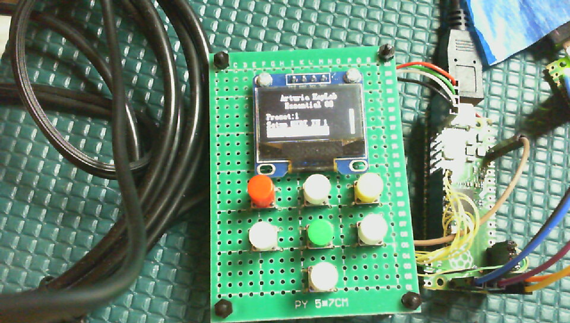
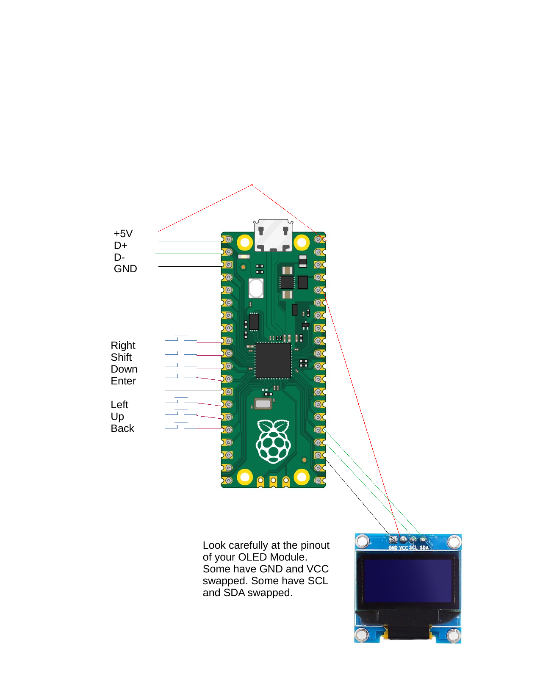
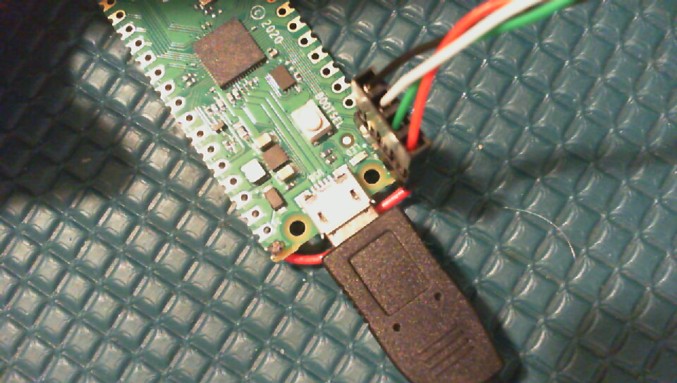

# pico-usb-midi-processor

The Pico USB MIDI Processor, or PUMP, is a Raspberry Pi Pico-based
general purpose device that processes USB MIDI data between a USB
Host such as a PC or Mac and an external USB MIDI device such as a keyboard
or control surface. It has both a USB A Host connector that connects to your
external MIDI device and a micro USB Device port that connects to your PC.



The PUMP has a basic UI made from
a 128x64 mono OLED display, 4 directional buttons (white), an Enter button
(green), a Shift button (yellow) and a Back button (red). The Up and Down
buttons double as increment and decrement buttons, and the Left button
doubles as a delete from the list button.

The PUMP inspects and can modify or filter out every USB MIDI packet
between the MIDI device and USB host on every USB MIDI IN and MIDI OUT
port of the connected device. This allows you to create almost any
filter or processor for the MIDI data. For example

- Transpose a range of notes for a given MIDI channel
- Implement fader pickup to prevent large fader jumps on your DAW
- Remap control surface buttons to work better with your DAW
- Remap MIDI channels for a range of notes or controllers to implement keyboard splits.
- Filter out Real-time messages
- and so on

You can add as many MIDI processing algorithms as the on-chip RAM allows
to make a complex processing chain for any MIDI port. The RP2040 has so much
on-chip RAM that running out is unlikely. The software framework is
flexible enough to allow new processing functions to be added.

The PUMP uses some of the Pico board's program flash to store
up to 8 presets for each unique external MIDI device
connected to it. Each new external MIDI device gets its own
set of 8 presets stored, so you will likely never run out
of presets.

# Hardware

The PUMP uses the native USB hardware to implment the USB MIDI device
interface, and it uses the Pico-PIO-USB project software plus a modified
tinyusb stack to implement the USB MIDI host interface. You set up the
hardware to process MIDI using a small SSD1306-based 128x64 dot monochrome
OLED display plus 7 buttons: 5 buttons for up, down, left, right, and
select plus a "Back/Home" button and a "Shift" button. I used 7
discrete buttons, but there are a number of ready-made assemblies
that use a 5-way "joystick" style switch for up/down/left/right/select
plus two more buttons to provide the 7-buttons. The OLED is a very
common I2C module that you can buy from any number of sources. You can
usually get it with white, blue or yellow dots.

The PUMP uses some of the Pico board's program memory flash chip
to store device settings, so the PUMP can remember the up to 8 different
configurations for each device that was attached previously (until it runs
out of setting storage, which is unlikely).

The PUMP uses 7 pins for the buttons, 2 pins for the USB Host, 2
pins for the OLED's I2C port, an 2 pins for a debug UART.

Wiring consists of the USB Host port, the buttons, the display, and optionally
and the debug port. Here is a crude wiring diagram with the debug hardware not
shown .

## Wiring the USB Host port

I used a [Sparkfun CAB-10177](https://www.sparkfun.com/products/10177) with the green and white
wires (D+ and D- signals) swapped on the 4-pin female header connector. I soldered a 4-pin male header
to pins 1-3 of the Pico board and left one of the pins hanging off the edge of the board. I soldered
a wire from that pin hanging off the edge of the board to Pin 40 of the Pico board (VBus). I then
plugged the 4-pin female header connector so the black wire (ground) connects to Pin 3 of the Pico
board, the red wire connects to pin hanging off the edge of the Pico board, the green wire connects
to pin 1 of the Pico board, and the white wire connects to pin 2 of the Pico board. If you want to
add series termination resistors to D+ and D-, resistors between 22 and 33 ohms are probably close.
I didn't bother and it seemed good enough for my testing. Here is a photo of
just the USB host wiring 

## Wiring the buttons

The software detects a button press as a GP pin shorted to ground. The software configures
each button GP pin to have the on-chip pull-up resistor active. Connect one pin of each of the
7 buttons to ground and connect the remaining pin of the button to its own GP input. I used
pin 13 of the Pico board for ground, pins 9-12 for Right, Shift, Down and Enter, and pins 14-16
for Left, Up and Back.

## Wiring the Display

Look very carefully at your OLED module. The diagram shows
one possible pinout. Many have VCC and GND swapped. Do
not hook these up backwards or your display may be destroyed.
There will be 4 pins on the top of the display labeled VCC, GND, SCL and SDA. The VCC 
pin goes to the 3.3V regulated supply output on Pico pin 36. The GND pin
goes to the GND pin on Pico pin 23. SCL and SDA go to Pico Pins 24 and 25,
respectively.

## Wiring the Picoprobe

You might not need to use a Picoprobe for debugging if you
are just building the code and using it. I find a Picoprobe
handy for debug. Because the USB host uses Pico pins 1 and 2, I use
Pico pins 21 and 22 for the debug UART. The SWCLK, GND and SWDIO pins
on the bottom of the board wire to the corresponding pins on the Pico Probe.

# Software Build Instructions
## Set up your environment

The PUMP project uses original code plus a lot of code from other
projects on GitHub. Most are git submodules. All code is written
in C, C++, or the RP2040's PIO state machine assembly code. To
build it, you need to install the Pico C SDK version 1.4.0 or later.
Install this code plus the compiler toolchain per the instructions 
in the [Getting Started with Raspberry Pi Pico C/C++ development](https://datasheets.raspberrypi.com/pico/getting-started-with-pico.pdf)
document Chapter 2. Unless you are using a Raspberry Pi for development,
you will need to follow the additional instructions in chapter 9 of the
same document. I recommend setting up Microsoft VS Code as described in
chapter 7, and I recommend installing OpenOCD and building a Picoprobe as
described in Appendix A for debugging and code development.

## Install and build the project source code
### Preview
This project uses the main application files plus some libraries
from various GitHub projects.
- the Pico-PIO-USB project and a fork of the tinyusb project to
implement the USB communications; the fork was required to add
USB MIDI Host functionality
- the parson project to implement JSON format settings storage
- a fork of the pico-littlefs project to implement a file system
on the Pico program flash; the fork is required to handle writing
to flash whilst both RP2040 cores are active
- some modified font files from various projects for the OLEDs

Some original library code includes
- pico-ssd1306-mono-graphics-lib, a higher performance C++ SSD1306
graphics library than others I tried. It also supports multiple
displays at once, which is useful for a future hardware attachment
I have planned for this project.
- pico-mono-ui-lib, a C++ UI library that supports multi-line menus
with scrolling, multi-screen navigation, the UI buttons, and
setting template classes that know how to serialize to JSON and deserialize
from JSON. It's not quite full MVC pattern, but it's not bad.

When you are installing the software, your directory structure
on your computer should look like this:
```
$PICO_DIR
    |
    +--pico-sdk
    |   |
    |   +--lib
    |       |
    |       +--tinyusb (from my forked code)
    |           |
    |          ...
    |           |
    |           +--hw
    |               |
    |               +--bsp
    |               |
    |               +--mcu
    |                   |
    |                  ...
    |                   |
    |                   +--raspberry_pi
    |                       |
    |                       +--Pico-PIO-USB (need to force
    |                           this submodule to install)
    |
    +--pico-usb-midi-processor
        |
        +--lib
        |   |
        |   +--pico-mono-graphics-lib
        |   |
        |   +--pico-mono-ui-lib
        |
        +--ext_lib
            |
            +--littlefs-lib (from my forked code)
            |
            +--parson
            |
            +--RPi-Pico-SSD1306-library
            |
            +--ssd1306
```

### Step By Step

To install on a Linux build host, use the following command line
commands. (A Mac Homebrew installation should use the same instructions;
I have no idea on a PC). `$PICO_DIR` refers to the some top level directory where
you are are storing your Raspberry Pi Pico source code.

```
cd $PICO_DIR

# get the project source code and the library submodules
git clone https://github.com/rppicomidi/pico-usb-midi-processor.git
git submodule update --recursive --init

# make sure you have the latest Pico C SDK
cd pico-sdk
git pull
# get my fork of the tinyusb library with MIDI Host support
cd lib/tinyusb
git remote add upstream https://github.com/hathach/tinyusb.git
git remote set-url origin https://github.com/rppicomidi/tinyusb.git
git fetch origin
git checkout -b pio-midihost origin/pio-midihost
# get the Pico-PIO-USB submodule into the source tree
cd hw/mcu/raspberry_pi
git submodule update --init Pico-PIO-USB
```

To build on a Linux build host, use the following command line
commands. (A Mac Homebrew installation should use the same instructions;
I have no idea on a PC). `$PICO_DIR` refers to the some top level directory
where you are are storing your Raspberry Pi Pico source code.
```
export PICO_SDK_PATH=$PICO_DIR/pico-sdk/
cd $PICO_DIR/pico-usb-midi-filter
mkdir build
cd build
cmake ..
make
```

Building using VS Code should be straightforward because I put a
`.vscode` directory in with the project.

# Operating Instructions

## Quick Start
Plug the PUMP's micro USB device port to a PC, Mac or other USB host.
The screen should show

```
PICO MIDI PROCESSOR
No Connected Device
```

Plug your keyboard or other MIDI device to the PUMP's USB Host Port.
You should see the device name on the top one or two lines of the
OLED followed by the current preset number, followed by a list of MIDI IN
and MIDI OUT ports that the device normally exposes to your PC's or Mac's USB Host port.

For example, when I connect my keyboard to the PUMP, the
display shows:

```
  Arturia Keylab
   Essential 88
Preset:1
Setup MIDI IN 1
Setup MIDI IN 2
```

`Preset: 1` should show in reverse video the first time you
every connect a device. MIDI IN and MIDI
OUT are from the USB Host's (the PC's or MAC's) perspective.

If you press the up or down buttons, you can navigate the menu.
If there are more than 2 total MIDI IN or MIDI OUT ports,
then all won't fit on the screen. A vertical progress bar on the
right will appear to let you know you can navigate beyond what
is visible. The display will scroll as required. If you want
to scroll beyond what is visible in one go, press and hold the
Shift button before you press the Up or Down button.

For example, if I scroll the home screen menu all the way
to the end, I see

```
  Arturia Keylab
   Essential 88
Setup MIDI IN 2
Setup MIDI OUT 1
Setup MIDI OUT 2
```

If a menu item is highlighted, you can press the Enter button
to go one menu level deeper or enter edit mode for the
highlighted menu item.

If you press the Back button, the UI will go back one screen. If 
you hold the Shift button and press the Back button, then the
UI will return to the home screen.

If you press the Enter button on when a menu item that starts "Setup MIDI"
is shown in reverse video, you can set up the processing for that MIDI port.

In the Setup screen, you add a processor by pressing the Select
button whilst `Add new processor...` is highlighted. A list of
available processors will show up. Use the Up and Down buttons
to the processor you want to add and then press the Select button
to add it. The UI will return to the MIDI port setup screen. The
screen will show the processor added right above `Add new processor...`
If you changed your mind before you added the
processor, press the Back/Home button to return to the MIDI port
setup screen. To go all the way back to the home screen,
hold the Shift button and then press the Back/Home button.

If you added a processor by mistake, highlight the processor using
the Up and Down buttons and then press the left button to delete it.
There is no confirmation, so be careful. You can configure the processor
by using the Up or Down buttons to highlight it, then pressing select.

You adjust most processor parameters by using the Up and Down buttons
to choose the paramater, then press the Select button
to edit the paramater. In this edit mode, the Up and Down buttons
increment or decrement the paramter value. Holding the Up or Down
buttons will repeat the increment or decrement action. Press and
hold shift and the pressing Up or Down will increase the increment
or decrement interval. If there are multiple parameters on a line,
use a the Left button or Right button to choose the parameter to
increment or decrement.

If a processor setting has two number fields in it, you can
navigate between the fields using the left and right buttons.

Once you start editing presets, the home screen will show
`Preset:1[M]` or similar. The `[M]` means that the current
preset has been modified. If you want to save it, highlight
the `Preset:1[M]` line on the home screen and press Enter.
You will see the Preset screen

```
 Current Preset:1[M]
Next Preset:1
Save next preset
Load next preset
Reset next preset
```
To save the changes to the current preset, navigate to 
`Save next preset` and press Enter. The preset will be saved and
the UI will return to the home screen. You will note that
the `[M]` is no longer displayed after the preset number.
That means the current preset is stored in flash.

If you change the Next Preset value in the preset screen,
you can save the current state to that new preset number,
you can load the settings for that preset number, or
you can start with a new blank preset with that number.

## Processing paths

Data from the attached device goes to the what the PUMP calls "MIDI IN" ports.
Data from the attached USB Host (usually a PC or
Mac running a DAW) goes to what the PUMP calls "MIDI OUT" ports.
Most devices only have one MIDI IN and one MIDI OUT, but some have more.

The PUMP will process every MIDI packet
through every processor you add to a MIDI port before sending it
on to its destination. Processing is done in the same order you
added it in the GUI, so if you are doing something complex where
the order of processing matters, be sure to add the processors in the right order.

Some processors have "feedback" processing. For example, if you
remap a control surface button that has an LED, usually the DAW
will use the same message to control the LED that the control
surface sends to the DAW to indicate button press. For example,
if pressing the button sends NOTE ON 50, to the DAW, then the
DAW will send back NOTE ON 50 to light the button's LED. If
you assign a PUMP processor to remap control surface button's MIDI note
number to something else, then that processor needs a feedback
process to map the message from the DAW back to the message the
control surface expects. The `Channel Button Remap` processor does
exactly that. If you add a processor to PUMP MIDI IN port, then
the feedback process gets automatically added to the corresponding PUMP
MIDI OUT port. This "feedback" process does not show on the MIDI OUT
Setup on the OLED screen, but it is there.

## List of MIDI Processors
- Channel Button Remap: convert the 2nd byte of a 3-byte
MIDI channel message to a different value; in the opposite
data direction, convert the second value back to the original
value. This is useful for remapping buttons that have LEDs
associated with them. For example, Mackie Control compatible
control surfaces use Channel Note On messages to convey
button presses to the host. The host will send back the same
channel message with velocity 0 to turn the button's LED off.
It will send Note On velocity 127 to turn the LED on.
- Channel Message Remap: same as Channel Button Remap without
the feedback path.
- MC Fader Pickup: Mackie Control compatible control surfaces
send fader movements embedded in Channel Pitch Bend messages.
If you move a fader and the host DAW is not synchronized to
it, then the DAW fader position will jump. To prevent jumps,
use this processor. Whenever the DAW sends a fader position
to the PUMP, the PUMP will record that position and will
not forward a fader movement from the attached MIDI device
until the fader position moves past the last position the
DAW sent.
- Transpose: if a channel note message passes into the
processor with the correct MIDI channel and within the
Min MIDI note and Max MIDI note note number range, then
the processor will add Halfstep delta halfsteps to the
note number. If the Halfstep delta value is negative,
then the processor will subtract halfsteps from the
note number.
- More processors are coming. I have not gotten to them
yet.
