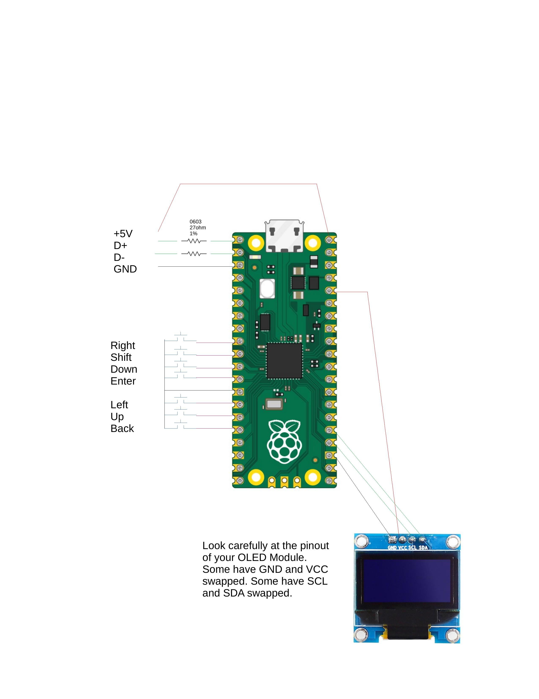

# pico-usb-midi-processor


The Pico USB MIDI Processor, or PUMP, is a Raspberry Pi Pico-based
general purpose device that processes USB MIDI data between a USB
Host such as a PC or Mac and an external USB MIDI device such as a keyboard or control surface. It has both a USB A Host connector that
connects to your external MIDI device and a micro USB Device port
that connects to your PC.

For a tutorial walkthrough of using the PUMP, see the [tutorial](./doc/TUTORIAL.md) document.

The PUMP has a basic UI made from a 128x64 mono OLED display, 4
directional buttons (white), an Enter button (green), a Shift button
(yellow) and a Back button (red).

The PUMP inspects and can modify or filter out every USB MIDI packet
between the MIDI device and USB host on every USB MIDI IN and MIDI OUT
port of the connected device. This allows you to create almost any
filter or processor for the MIDI data. For example

- Transpose a range of notes for a given MIDI channel
- Implement fader pickup to prevent large fader jumps on your DAW
- Remap control surface buttons to work better with your DAW
- Remap MIDI channels for a range of notes or controllers to implement keyboard splits.
- Filter out Real-time messages
- and so on

You can add as many MIDI processing algorithms as the on-chip RAM allows
to make a complex processing chain for any MIDI port. The RP2040 has so much on-chip RAM that running out is unlikely. The software framework is
flexible enough to allow new processing functions to be added.

The PUMP uses some of the Pico board's program flash to store
up to 8 presets for each unique external MIDI device
connected to it. Each new external MIDI device gets its own
set of 8 presets stored, so you will likely never run out
of presets.

The PUMP USB A port can also accept a USB Flash Drive to allow you to back up and restore all of your presets at once or the presets of one device
only. Future versions of this code will allow you to export and import
presets one preset at a time to any one device.

# Disclaimers

This project requires correctly soldering a USB host port connector
to a Raspberry Pi Pico board. The circuit described here has no current
limiting, ESD protection, or other safeguards. Measure voltages carefully
and please don't hook this to your expensive computer and MIDI equipment
until you have done some testing with at least some basic test equipment.

Also, any brand name stuff I mention in this README file is just
documentation of what I did. This is not an advertisement. I don't get
paid to do this.

If you find issues with this document or with the code, please report them
on this project's [github page](https://github.com/rppicomidi/pico-usb-midi-processor).

# Hardware

The PUMP uses the native USB hardware to implement the USB MIDI device
interface, and it uses the Pico-PIO-USB project software plus a modified
tinyusb stack to implement the USB MIDI host interface. You set up the
hardware to process MIDI using a small SSD1306-based 128x64 dot monochrome
OLED display plus 7 buttons: 5 buttons for Up, Down, Left, Right, and
Enter plus a "Back/Home" button and a "Shift" button. I used 7
discrete buttons, but there are a number of ready-made assemblies
that use a 5-way "joystick" style switch for Up/Down/Left/Right/Enter
plus two more buttons to provide the 7-buttons. The OLED is a very
common I2C module that you can buy from any number of sources. You can
usually get it with white, blue or yellow dots.

The PUMP uses some of the Pico board's program memory flash chip
to store device settings, so the PUMP can remember the up to 8 different
configurations for each device that was attached previously (until it runs
out of setting storage, which is unlikely).

The PUMP uses 7 pins for the buttons, 2 pins for the USB Host, 2
pins for the OLED's I2C port, and 2 pins for a debug UART.

Wiring consists of the USB Host port, the buttons, the display, and optionally
the debug port. Here is a crude wiring diagram with the debug hardware not
shown .

## Wiring the USB Host port

I used a USB A female breakout board for the USB Host connector. I
cut the D+ and D- minus traces and scraped back enough solder mask
to solder in two 0603 27 ohm 1% metal film resistors in line with
the D+ and D- signals. I wired the D+ signal post resistor to Pico
board pin 1, and I wired the D- signal post resistor to Pico board
Pin 2. I wired the +5V of the breakout board to the Pico Vbus pin 40. I wired the GND of the breakout board to Pico GND pin 3.


## Wiring the buttons

The software detects a button press as a GP pin shorted to ground. The software configures each button GP pin to have the on-chip pull-up resistor active. Connect one pin of each of the 7 buttons to ground and connect the remaining pin of the button to its own GP input. I used pin 13 of the Pico board for ground, pins 9-12 for Right, Shift, Down and Enter, and pins 14-16 for Left, Up and Back.

## Wiring the Display

Look very carefully at your OLED module. The diagram shows one possible pinout. Many have VCC and GND swapped. Do not hook these up
backwards or your display may be destroyed. There will be 4 pins on
the top of the display labeled VCC, GND, SCL and SDA. The VCC pin
goes to the 3.3V regulated supply output on Pico pin 36. The GND pin
goes to the GND pin on Pico pin 23. SCL and SDA go to Pico Pins 24
and 25, respectively.

## Wiring the Picoprobe

You might not need to use a Picoprobe for debugging if you
are just building the code and using it. I find a Picoprobe
handy for debug. Because the USB host uses Pico pins 1 and 2, I use
Pico pins 21 and 22 for the debug UART. The SWCLK, GND and SWDIO pins
on the bottom of the board wire to the corresponding pins on the Pico Probe.

## A more costly, but easier build circuit

If soldering all of those wires seems like too much, you can use the
[Adafruit RP2040 Feather with USB A Host](https://learn.adafruit.com/adafruit-feather-rp2040-with-usb-type-a-host/overview) board instead
of a Pico board and a USB A breakout board and you can use a breakout
board with a 5-way navigation switch plus two buttons, plus the OLED
breakout board. Then you can easily wire it up on a breadboard.

.

In that photo, the SET button is the Back button and the RST button is the
Shift button. Pressing the nav switch straight down grounds the MID pin,
and performs the ENTER function. For those curious, I used
[this board](https://www.amazon.com/ACEIRMC-5-Channel-Direction-Navigation-Independent/dp/B09DPMQ1F3?ref_=ast_sto_dp) in the photo. To get it to look like the photo,
I had to remove the pre-soldered header and solder in straight
pins. If I had to do it over again, I would have used a cable
with female headers on one end and pin headers on the other
to wire to the breadboard.

The `CMakeFiles.txt` file is set up to assume you wired it as
follows:
OLED VCC->Feather board 3.3V
OLED BOARD GND->Feather board GND
OLED SDA->Feather board SDA pin
OLED SCL->Feather board SCL pin
SHIFT Button->Feather board D5 pin
BACK Button->Feather board D6 pin
ENTER Button->Feather board D9 pin
RIGHT Button->Feather board D10 pin
LEFT Button->Feather board D11 pin
DOWN Button->Feather board D12 pin
UP Button->Feather board D13 pin
Button board COM->Feather board GND
UART adapter Rx and Tx to Feather Board Tx and Rx

# Software Build Instructions
## Set up your environment

The PUMP project uses original code plus a lot of code from other
projects on GitHub. Most are git submodules. All code is written
in C, C++, or the RP2040's PIO state machine assembly code. To
build it, you need to install the Pico C SDK version 1.5.1 or later.
The environment is a bit simpler to set up using Pico SDK version 2.0.
Before you attempt to build this project, please set up and build the
[pico-usb-midi-filter](https://github.com/rppicomidi/pico-usb-midi-filter?tab=readme-ov-file#software) as described in the linked Software section
of the `README.md` file. That section describes how to set up the
SDK, and patch the TinyUSB library.

## Install and build the project source code
### Preview
This project uses the main application files plus some libraries
from various GitHub projects.
- the Pico-PIO-USB project and a patched version of TinyUSB
implement the USB communications with the help of two application
USB MIDI drivers.
- the parson project to implement JSON format settings storage
- a fork of the pico-littlefs project to implement the littlefs
flash file system with journal and wear leveling on the Pico
program flash; the fork is required to handle writing to flash
whilst both RP2040 cores are active
- the embedded-cli project to implement a debug command line
interpreter; type help on the serial port console for a list of 
commands. Notably, the `screenshot` and `save-screenshots` commands
are supported using this CLI library.
- the elm-chan fatfs file system modified to work with tinyusb for implementing external flash drive for preset backkup and exporting
screenshot files.
- some modified font files from various projects for the OLEDs

Some original library code includes
- pico-ssd1306-mono-graphics-lib, a higher performance C++ SSD1306
graphics library than others I tried. It supports screen capture to BMP,
which makes documentation a bit simpler. It also supports multiple
displays at once, which is useful for [this project](https://github.com/rppicomidi/pico-mc-display-bridge).
- pico-mono-ui-lib, a C++ UI library that supports multi-line menus
with scrolling, multi-screen navigation, the UI buttons, and
setting template classes that know how to serialize to JSON and deserialize
from JSON. It's not quite full MVC pattern, but it's not bad.

When you are installing the software, your directory structure
on your computer should look like this:
```
$PICO_DIR
    |
    +--pico-sdk
    |   |
    |   +--lib
    |       |
    |       +--tinyusb (patched)
    |           |
    |          ...
    |           |
    |           +--hw
    |               |
    |               +--bsp
    |               |
    |               +--mcu
    |                   |
    |                  ...
    |                   |
    |                   +--raspberry_pi
    |                       |
    |                       +--Pico-PIO-USB (need to force
    |                           this to install)
    |
    +--pico-usb-midi-processor
        |
        +--lib
        |   |
        |   +--pico-mono-graphics-lib
        |   |
        |   +--pico-mono-ui-lib
        |   |
        |   +--usb_midi_dev_ac_optional
        |   |
        |   +--usb_midi_host
        |
        +--ext_lib
            |
            +--embedded-cli (for debugging lfs and fatfs)
            |
            +--fatfs (more recent fatfs rev than tinyusb's fatfs)
            |
            +--littlefs-lib (from my forked code)
            |
            +--parson (a git submodule)
            |
            +--RPi-Pico-SSD1306-library (a font library)
            |
            +--ssd1306 (a font library)
```


### Installing and building the Project Source Code

These instructions assume you have already been able to build the
`pico-usb-midi-filter` project to test the toolchain and the
patched version of TinyUSB.

To install on a Linux build host, use the following command line
commands. `${PICO_DIR}` refers to the some top level directory where
you are are storing your Raspberry Pi Pico source code.

```
cd ${PICO_DIR}

# get the project source code and the library submodules
git clone https://github.com/rppicomidi/pico-usb-midi-processor.git
git submodule update --recursive --init
```
To do a command line build, follow the same workflow as the
`pico-usb-midi-filter` project. Make sure to set the `PICO_BOARD`
CMake variable in the CMake command line to match your hardware.

Building using VS Code should be straightforward because I put a
`.vscode` directory in with the project. If you are using the
Raspberry Pi Pico extension for VS Code, click on the Pico icon
in the left window and import the project. It should import cleanly.
Don't forget to set the `PICO_BOARD` variable in the CMake Configuration settings.

Whether building on the command line or using VS Code, please note that
the supported values of `PICO_BOARD` are `pico` and `adafruit_feather_rp2040_usb_host`.

# Operating Instructions

For a tutorial walkthrough of using the PUMP, see the [tutorial](./doc/TUTORIAL.md) document.

## UI Basics
Most of the UI for the PUMP is made up of text menus that you navigate
using "arrow buttons" up, down, left and right. You use single presses
of the arrow buttons to navigate the menus. If you press and hold, then
the arrow buttons will auto-repeat. If you hold shift and press arrow
buttons, the interval will be larger. The menu item you have navigated to
is shown in reverse video. If the menu item text has ... after it, it
means that if you press the Enter button while it is displayed in reverse
video, then a new screen will be displayed. You can always go back a screen by pressing the Back button, and you can return to the Home screen
by holding the Shift button and pressing the Back button.

If there are more menu items than will fit on a screen, then a vertical scroll bar will appear to the right showing you how many more items remain to be displayed.

Some menus dynamically add items to the menu. For example, `Add new processor...` will add a new process to a MIDI port's processing list.
You can delete dynamically added menu items by holding shift and pressing
the Left button.

Some menu items contain editable number fields. To edit a number in a
menu, navigate to the menu item containing the number, and press Enter.
The number field will highlight instead of the whole menu item. Use
the Up and Down buttons to edit the value. If the menu item contains
more than one number, use the left and right buttons to change number
fields. When done editing, press Enter again to record the change; the
whole menu item will again be highlighted.

Some menu items contain a toggle parameter. For example, the `Display Decimal/Hex` menu item will toggle between `Display Decimal` and
`Display Hex` when you press the Enter button.

Some menu items are selected from a list. For example, when you press
`Add New Processor`, you need to choose a MIDI processor type from a list.
If it is a parameter you choose from a list, then pressing Enter will
change to a screen with the list of items to choose; navigate to the item
you want and press Enter to select it.

Once you start editing presets, the home screen will show
`Preset:1[M]` or similar. The `[M]` means that the current
preset has been modified. If you want to save it, highlight
the `Preset:1[M]` line on the home screen and press Enter.
You will see the Preset screen


To save the changes to the current preset, navigate to 
`Save next preset` and press Enter. The preset will be saved and
the UI will return to the home screen. You will note that
the `[M]` is no longer displayed after the preset number.
That means the current preset is stored in flash.

If you change the Next Preset value in the preset screen,
you can save the current state to that new preset number,
you can load the settings for that preset number, or
you can start with a new blank preset with that number by using
`Reset next preset`.

If you don't want to use the PUMP with a particular device
anymore, or if something goes wrong with the PUMP settings
memory, you may need to use that `Presets menu...` option.
Selecting it gives you this screen:


`Delete all` erases all the presets in preset memory but does
not fully reformat the preset memory.

`Reformat memory` reformats the preset memory and deletes all
of the preset files.

If you only want to delete one device's presets, choose its
preset file name, which is made up the of the USB MIDI device's
Vendor ID and Product ID. When you navigate to one of those, PUMP
displays the product's name on the first two lines of the screen.
For example


PUMP supports backing up and restoring preset files to
any USB flash drive up to 32 GB. Just unplug your MIDI device
and plug in a USB flash drive. You will see a screen for setting
up the on-chip real-time clock date and time:


All files on the USB flash drives have a date and time stamp. As
you modify files on the drive, the Pico will update that date and
time stamp as read from the on-chip real-time clock. To set the
date and time, use the left and right arrows to highlight a field
and the up and down arrows to change the values. Press Set when
you are done. When you do that, you will see a new screen


You can select `Set Date/Time...` to fix the date and time if
you chose `Set` by mistake.

If you choose `Backup...` you will
see a new screen with only one option


If you press select, the PUMP will copy all preset files in preset
memory to the USB flash drive in the folder `/rppicomidi-pico-usb-midi-processor/[Next Backup Folder]` where
`[Next Backup Folder]` is the 2nd line of the display. The format
is `MM-DD-YYYY-V` where `MM` is the 2-digit month, `DD` is the
2-digit day, and `YYYY` is the 4-digit year. If you choose to
backup all presets more than once on a given day, the PUMP will
add `-V` after the date part of the directory name, where `V`
is the number of times after the first one that the backup
was saved to this flash drive.

If you choose the `Restore...` option from the `Save/Restore Presets to Flash Drive` screen, you will see


This screen will show you a list of all backup directories that
contain presets. Choose the backup directory you want to use. You
will see a screen like this:


The `All files` choice will restore to the preset memory all
of the preset files that were backed up to the selected folder.
If you only want to restore a single device's presets, you should
choose a single file. Files are named by the device's USB Vendor
and Product ID numbers. When you navigate to one, PUMP will display
the name of the device on the first two lines of the screen. For
example:


When you press the Enter button, PUMP will restore the presets
only for that device.

For your convenience, the `Save/Restore Presets to Flash Drive` menu
also provides a way to access the `Presets memory...` option.

## Processing paths

Data from the attached device goes to the what the PUMP calls "MIDI IN" ports.
Data from the attached USB Host (usually a PC or
Mac running a DAW) goes to what the PUMP calls "MIDI OUT" ports.
Most devices only have one MIDI IN and one MIDI OUT, but some have more.

The PUMP will process every MIDI packet
through every processor you add to a MIDI port before sending it
on to its destination. Processing is done in the same order you
added it in the GUI, so if you are doing something complex where
the order of processing matters, be sure to add the processors in
the right order.

Some processors have "feedback" processing. For example, if you
remap a control surface button that has an LED, usually the DAW
will use the same message to control the LED that the control
surface sends to the DAW to indicate button press. For this example,
if pressing the control surface button sends NOTE ON 50 to the DAW, then the
DAW will send back NOTE ON 50 to light the button's LED. If
you assign a PUMP processor to remap control surface button's MIDI note
number to something else, then that processor needs a feedback
process to map the message from the DAW back to the message the
control surface expects. The `Channel Button Remap` processor does
exactly that. If you add a processor to PUMP MIDI IN x port, then
the feedback process gets automatically added to the corresponding PUMP
MIDI OUT x port. This "feedback" process does not show on the MIDI OUT
Setup on the OLED screen, but it is there.

## List of MIDI Processors
- Channel Button Remap: convert the 2nd byte of a 3-byte
MIDI channel message to a different value; in the opposite
data direction, convert the second value back to the original
value. This is useful for remapping buttons that have LEDs
associated with them. For example, Mackie Control compatible
control surfaces use Channel Note On messages to convey
button presses to the host. The host will send back the same
channel message with velocity 0 to turn the button's LED off.
It will send Note On velocity 127 to turn the LED on. This
processor can convert or filter any of the 128 different
channel message values for a given type, (e.g., note, CC, etc.)
In the settings screen you can display the note number, CC
number, etc. in Decimal or Hex format. The screen shows a
forward direction remap as`vv->yy`, where `vv` is the original
note number, CC number, etc. and `yy` is the new value. The
feedback path will convert `yy` to `vv`. If you want to filter out
a particular `vv` so the message is not passed on at all,
increment the `yy` value until it shows `**`. The same
works in reverse for the feedback path.
- Channel Message Remap: same as Channel Button Remap without
the feedback path.
- MC Fader Pickup: Mackie Control compatible control surfaces
send fader movements embedded in Channel Pitch Bend messages.
If you move a fader and the host DAW is not synchronized to
it, then the DAW fader position will jump. To prevent jumps,
use this processor. Whenever the DAW sends a fader position
to the PUMP, the PUMP will record that position and will
not forward a fader movement from the attached MIDI device
until the fader position moves past the last position the
DAW sent.
- Transpose: if a channel note message passes into the
processor with the correct MIDI channel and within the
Min MIDI note and Max MIDI note note number range, then
the processor will add Halfstep delta halfsteps to the
note number. If the Halfstep delta value is negative,
then the processor will subtract halfsteps from the
note number. You can view the min and max note numbers
in Decimal or Hex format in the settings screen.
- More processors are possible. If you made one yourself,
please file a pull request and I will consider adding it.
If you have a specific request, please file an issue and
I will try to get to it if I have time.
