# Tutorial Demonstration
Plug the PUMP's micro USB device port to a PC, Mac or other USB host.
The screen should show the home screen of the UI. If you have nothing connected to the PUMP's USB host port, you will see:

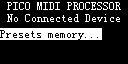

The `Presets memory...` menu doesn't do much useful until you
have used the PUMP for a while, so it is discussed later.

For now, plug your keyboard or other MIDI device to the PUMP's USB Host Port. The home screen will change to display the device name on the top one or two lines of the OLED followed by the current preset number, followed by a list of MIDI IN and MIDI OUT ports that the device normally exposes to your PC's or Mac's USB Host port.

For example, when I connect my keyboard to the PUMP, the
display shows the home screen, which is a menu that looks like this:

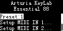

and your MIDI device will enumerate on your PC or Mac. If you experiment
with your MIDI device now, it should work just the same as it does when
you plug it directly to your PC or Mac.

Most of the UI for the PUMP is made up of text menus. You use single
presses of the arrow keys to navigate the menus. If you press and hold,
then the arrow keys will auto-repeat. If you hold shift and press arrow
keys, the interval will be larger. The menu item you have navigated to is
shown in reverse video. If the menu item text has `...` after it, it means
that if you press the Enter button while it is displayed in reverse video,
then a new screen will be displayed. You can always go back a screen by
pressing the Back button, and you can return to the Home screen by holding
the Shift button and pressing the Back button.

If there are more menu items than will fit on a screen, then a vertical scroll bar will appear to the right showing you how many more items remain
to be displayed. For example, on this home screen, if I press and hold the
Shift button and I press the Down button, I see

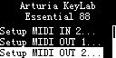

To make the PUMP useful, you need to add some processors to the MIDI IN
(to process MIDI from your MIDI device to the PC or Mac) and MIDI OUT
(to process MIDI data from your PC or Mac to the MIDI device). If your
device's USB MIDI implementation has more than one MIDI port, then
you can add processing to any or all ports.

This example demonstrates setting up processing on the PUMP to make the
Arturia Keylab Essential 88 work better with Cubase in Mackie Control mode.
This keyboard controller's USB interface has 2 MIDI IN and 2 MIDI OUT. In
DAW control mode, DAW controls are on port 2 and all other keys are on
port 1. I want to change the data sent from the keyboard to the DAW, so
I need to add MIDI processors to MIDI IN 2. Navigate to `MIDI IN 2...` and press the Enter button. I see

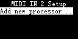

I press the Enter button again so I can add a processor from the list of processors

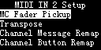

The first thing I need to do is remap the MIDI messages for 3 buttons
and their associated LEDs. To do that, I choose `Channel Button Remap`.

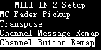

and then press the Enter button. Now the `MIDI IN 2 Setup` screen looks
like this:

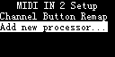

If I press the Up button to select `Channel Button Remap` and press the
Enter button, I can set up the processor:

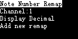

A Mackie Control button sends note on messages to the DAW and receives note
on messages from the DAW to change the button LED state. To change the
functionality, of a button, I have to remap its note number. `Note Number
Remap` is correct. Mackied Control button messages are all on channel 1,
so the selected channel is correct. I prefer working with note numbers in
Hex, so I navigate to `Display Decimal` and press Enter. That changes the
screen to `Display Hex`. Then I navigate to `Add new remap` and press
Enter. I see `Remap:**->**` highlighted. 

The UI shows remaps with the "from" number to the left of the arrow and
the "to" remapped number to the right. If the number is shown with
all asterix (`*`) symbols, then the remap is disabled if it is on the
left side and it is filtered out if on the right side. `**->**` does
nothing. I press Enter again to set up the remap. The screen looks like
this now:

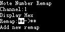

As you can see, just one `**` is highlighted. That means I can edit it.
I use the Up and Down buttons (and the Shift button to make big jumps)
to change the "from" note number to `50`.

Next I press the Right button to edit the "to" note number. I use the Up,
Down and Shift buttons to set the "to" note number to 48.

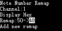

Finally, I press the Enter button record the changes

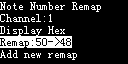

Now the Up and Down Buttons navigate the menu again. I need to remap note
51->46 and filter out note 58. The result is.

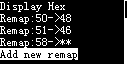

The button remapping is done. I press the Back button, and then I add the
`MC Fader Pickup` processor so that Mackie Control fader movements don't
make values "jump" when I first move them. The screen looks like this:

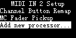

If I navigate to `MC Fader Pickup` and press Enter, I see

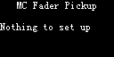

So I am done. I press Shift and Back. Now I see

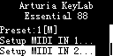

The `[M]` means Preset 1 data has been modified and will not be saved if
I unplug the keyboard from the PUMP or if I unplug the PUMP from my
computer. I want to save the current changes back to preset 1.
I navigate to `Preset:1[M]` and press Enter. I see the `Next Preset:` is
already 1, so I navigate to `Save next preset`

and press Enter. The PUMP automatically returns to the Home screen when
Preset 1 is saved. The `[M]` is now gone from the home screen.

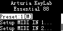

